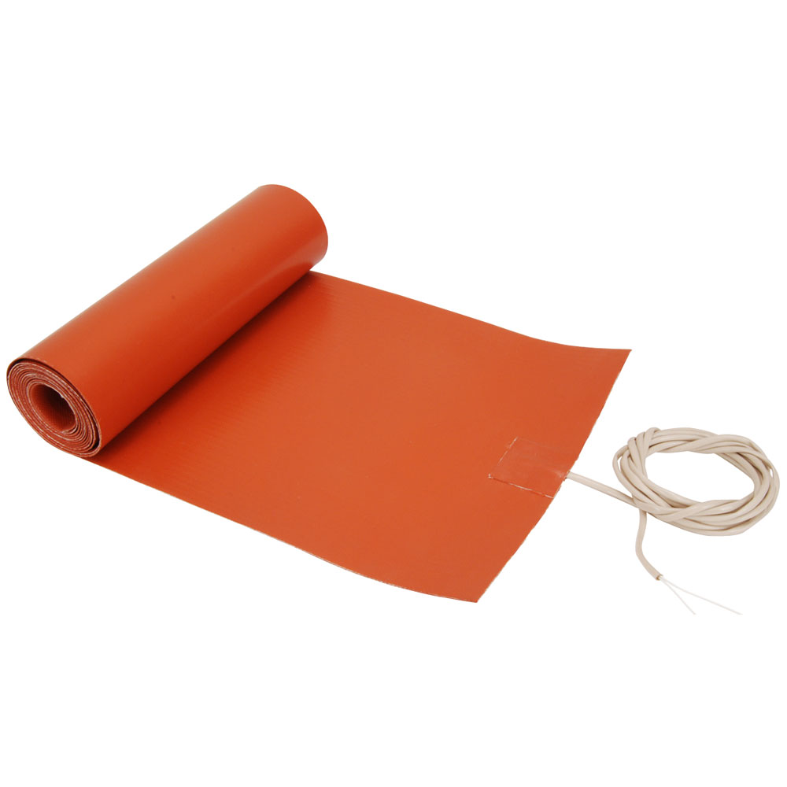

# Bowen Worklog
## 1/19/22 - Initial brainstorming
This was the first time we met as a team. We all came up with 2-3 ideas beforehand to discuss. We didn't decide on an idea this meeting, but we came up with some new ones to post to the forum and get feedback. 

## 1/22/22 - Idea expansion
We discussed and expanded on Colin's "winter-proof device for household pipes" idea because some professors seemed to like it. We talked about some components we might want, including a microcontroller, WiFi module, and various power converters. We also found a vendor for silicone rubber heaters. They come in many sizes and voltages so we have plenty of options to choose from.

[link](https://www.tempco.com/Tempco/Resources/Part-Numbers/Silicone-Rubber-Heater-Preconfigured-Part-Numbers.htm)

One professor mentioned how this project could be a data collection project rather than a concrete solution, so we also talked about the possibility of doing that. 