# Bowen Worklog
## 2/7/22 - Work on proposal
We met and worked on our project proposal. We found some components that could work for our sensors and researched the difference between a photodiode and light dependent resistor. It seems that a light dependent resistor is cheaper, has a slower response, and is tuned to the visible spectrum. Since weather changes slowly, an LDR might be a bettery choice than a photodiode. 

- SEN-18364 humidity and temperature sensor
    - 2.2V - 5.5V
    - I2C communication
    - op. temp: -40&deg;C to 80&deg;C
- GP2Y0A21YK0F IR sensor
    - 4.5V - 5.5V
    - 30mA operating current
    - op. temp: -10&deg;C to 60&deg;C

We also researched how to smoothly switch between two different power sources and found something called a power mux. However, none of the components could support a 24V input, so we might need to find something else, or switch to 12V LEDs. 

## 2/8/22 - First TA meeting
Today, we met with Qingyu and went over our proposal. He said we were progressing nicely, but he did have some comments. He advised us to:
- figure out how to demonstrate our final product
- add numbers and details to the high level requirements
- list specific communication protocols on our block diagram
- talk to another TA or professor about our power electronics questions

We were unsure if the 24V input switching was possible between the solar panel and grid power, so we will need to talk to someone with more experience in that field.

## 2/9/22 - Talk to TA
I went to Stasiu's office hours and asked him about the power switching system. If we used a voltage less than 24V, we could use a power mux. If we want to keep 24V, we might be able to create a switching network with solid state relays because of their fast switching speed, diodes to prevent reverse current flow, and some large capacitors to minimize volage transients.

## 2/14/22 - Picked out some components
We discussed power protection circuitry and implementing the switching network with either [LTC4357s](https://www.analog.com/media/en/technical-documentation/data-sheets/4357fd.pdf) or [LTC4359s](https://www.analog.com/media/en/technical-documentation/data-sheets/ltc4359.pdf). Both ICs provide similar functionality in terms of protection, but the LTC4359 has a shutdown pin which we can control using our microcontroller. We want to use an ATmega328, but they are out of stock everywhere. We might try to take one from an Arduino. I also worked on the KiCad schematic and mostly completed the microcontroller part. I added a 16MHz crystal oscillator, AVR programmer, power LED indicator, and a reset button.

## 2/15/22 - Weekly TA meeting
We met with our TA and he went over some concerns that he had. If the humidity sensor for some reason did not work in adverse weather conditions, we would have a manual override to change the light brightness to maximum. We clarified our design for the switching network and mentioned that we plan to use the LTC4359 to provide circuit protection and facilitate switching. Additionally, a current/voltage sense was needed to monitor the solar panel's output power. In order to monitor solar power when it is disconnected, we wanted to have a power resistor dissipating the excess power as heat. I worked on the 3.3V and 5V buck converters and chose components for them. 

## 2/19/22 - Work on schematic/simulations
I used LTspice to create a simulation of our 3.3V and 5V buck converters as well as the switching network using the LTC4359 ICs. We wanted to verify that our design could theoretically switch between solar and grid power supplies while minimizing voltage transients and switching time. The reference schematic was taken from the [LTC4359's datasheet](https://www.analog.com/media/en/technical-documentation/data-sheets/ltc4359.pdf) and modified to fit  our voltage and current requirements (3A at 24V). 

The two figures below show the voltage output and shutdown signals respectively. We can see that even when both outputs are off for 0.5ms, the voltage does not drop below around 23.89V, which fulfills our requirement. 

## 2/22/22 - Design document check
We had our design document check meeting today with Prof. Shao. She suggested we put more detail (power/data lines) into our block diagram, include more quantitative requirements & verifications, and include power drawn by sensors. We also determined that the switching network exceeded voltage transient requirements when we added a dummy load, so we will need to fix it.

## 2/28/22 - Power board PCB
I finished creating the schematic for the power board, which contains the 3.3V and 5V buck, 24V sepic converter, and the switching network. 

I also laid out the PCB. I tried to keep all systems together and ensure thick traces/copper pours when dealing with high current (anything greater than 1A). I used Colin's inductor and switching maximum current calculations to determine the upper bound on the trace widths. The maximum widths should be around 2.3mm and 3.9mm respectively. Since I used thick copper pours, trace width should not be an issue, especially in typical operating conditions.

## 3/1/22 - Design document presentation/PCB board check
Today we presented our design document and received a few criticisms. The first bullet point of our high level requirements should include the power cost estimate of the entire system and compare it with a normal traffic light system to see how much energy/money we expect to save. There were also minor comments like changing the colors/background of some figures to make it more legible. 

We only finished the power board for the PCB board check. Our board was over the 100mm x 100mm size, so I needed to move the 3.3V and 5V buck converters onto the MCU board. We found that 4mm banana cables are able to connect to the solar panel, so I added 4mm connectors to the PCB. According to [wikipedia](https://en.wikipedia.org/wiki/Banana_connector), banana connectors are rated for 30V at 15A, which is enough for our case. I added the power monitoring IC and components as well. R3-R6 are 0Ω resistors meant for determining the device addressing. We can choose which resistors to solder depending on what we need in the future. This is the new power board.

For the light board, we will need to perform some tests on the lights to determine if we need a current limiting resistor. I couldn't find anything in the datasheet.

## 3/2/22 - Testing lights & light board
Richard and I used a power supply to determine the current draw of the lights and found the following:
Red: 24V and 0.23A
Yellow: 24V and 0.21A
Green: 24V and 0.31A

We also took apart one of the lights to find that there was internal circuitry, which most likely already contains some current limiting resistor. This means that for the light PCB, I can just connect the lights directly to 24V. The bike light that we got was not powered by 24V like we thought, but instead 120VAC. In order to control ON/OFF, I needed a relay. Since we were planning on using PWM for the bike lights, I looked into solid state relays since they have a higher switching speed than regular contact relays. However, they were either all sold out or out of our budget. So, we decided for the bike light to function without PWM. I found [this](https://www.digikey.com/en/products/detail/te-connectivity-potter-brumfield-relays/1462041-7/2126941) relay, which supports up to 2A and is controlled by 5V. I also needed to ensure that AC and DC neutral/ground were separated. In the following figure, the AC stuff is in the top right corner for the bike light.

## 3/6/22
We decided that we wanted to isolate the 24V from the 5V and get rid of the 3.3V rail. The humidity sensor was the only sensor that used 3.3V, but we looked into its datasheet and saw that the maximum supply voltage was up to 5.5V, so we will use 5V to power it. This is the new power board and light board with optoisolators. For the power board, I decided to have pinheaders for the grid/solar control input of the switching network. This is because the optoisolators are at the bottom of the PCB while the LT1161 is at the top. I could have routed the signals on the bottom layer, but that would essentially cut my ground plane in two, which can cause ground loops

## 3/22/22
Today we picked up our PCBs and sorted our components to match the three boards. We also had our TA meeting, but there wasn't much to update on since we just came back from spring break.

## 3/23/22
I spent a bunch of time trying to debug the light board and found some issues. The N-channel MOSFET should be on the low side, rather than connected to 24V. This is because currently, the Vgs is floating, when it should be the voltage from gate to ground. The VIN and GND of the relay should be switched around. Also, the optoisolator had a very large voltage drop (10.7V) when there is 5V across the anode/cathode and 12V across the collector/emitter, and I'm not really sure why. It might be because of the 10k resistances. I soldered 1k resistors and it seemed to help a bit. I'll have to try lower values and see if they work. 
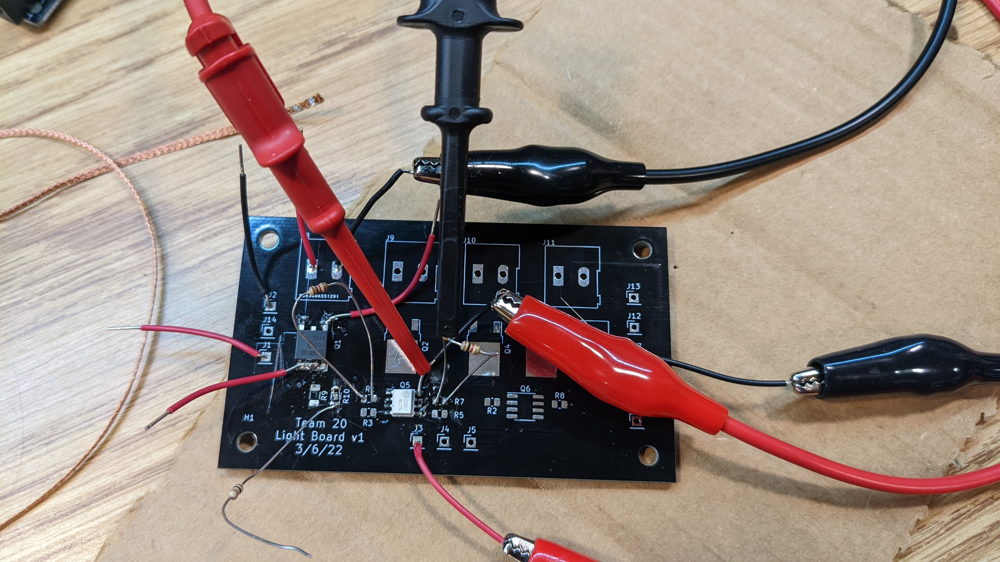
The power board had some blatant issues. The power resistor needs larger through holes, and we need to make space for the large heatsink and its mounting holes. We need to change the sepic MOSFET footprint to a SOIC-8 and capacitor C24 and C25 footprints to match what we ordered.

## 3/24/22
I figured out what was wrong with the optoisolators. The 10k resistors on the inputs were too large and thus very little current was flowing through the diode inside the isolator. According to the datasheet, there should be around a 1V drop across the diode at 30mA. When I changed the resistors to 150 ohms, the isolators functioned as expected. 

Another thing that went wrong was the 12V divider I made to power the MOSFET gates. I wanted to ensure the turn on time was minimal, but I didn't realize that it depended on the gate current. Since I didn't want another buck converter on the board, I tried testing the MOSFETs to see if they would work with a 5V Arduino input. They ended up working using Arduino's analogWrite() as a PWM. This means we don't need a 12V rail and can either use our old 5V buck converter IC to create an isolated noisy 5V rail that's separate from the MCU's 5V rail or directly control the gates with the Arduino. I'll probably include both in our version 2 PCBs and add jumpers to decide which way we want.

I also tested the photocell voltage divider and ensured it worked. The first picture below is the test circuit I used. The resistor is 1k. The second image is the voltage across the resistor when uncovered and the third is when it was covered.
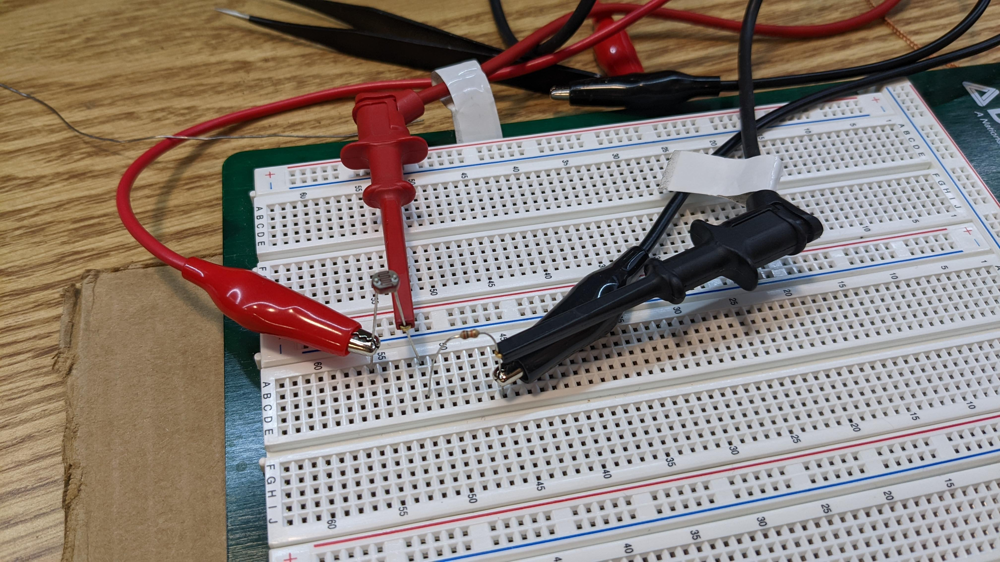
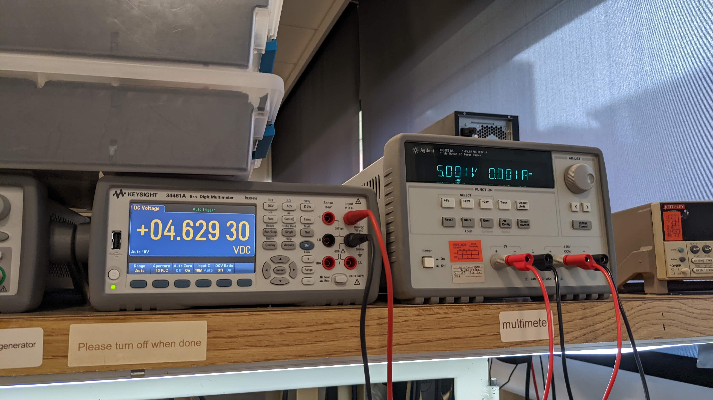
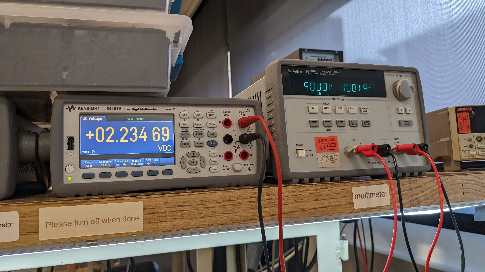

Finally, I tested the power board's switching network and discovered something called [dielectric absorption](https://en.wikipedia.org/wiki/Dielectric_absorption). Essentially, large capacitances, even when disconnected from a power source, can slowly gain voltage over time, so I'll have to be careful working with this board. The switching network seems fine when I switch to grid power, but doesn't work when trying to switch to solar. I'll have to debug more later.

## 3/25/22
Today I tried burn a bootloader onto our MCU board's ATmega328p. I first tried to burn a bootloader between two Arduino MEGAs, and I used [this](https://support.arduino.cc/hc/en-us/articles/360012048060-How-to-burn-the-bootloader-between-two-Arduino-Mega) tutorial which helped a lot. I needed to change some pins (RESET, PIN_MOSI, PIN_MISO, AND PIN_SCK) in the ArduinoISP code. I also used [this](https://maker.pro/custom/tutorial/programming-an-atmega328-microcontroller-on-a-pcb) article to use the Arduino MEGA as a programmer. Below is my testing setup.
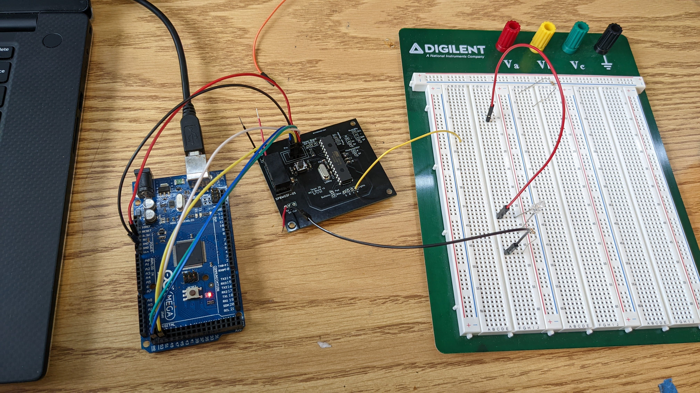

I got the blink sketch to run on our MCU board. I was defining the LED pin incorrectly. For future reference, use [this](https://components101.com/sites/default/files/inline-images/ATMega328P-Arduino-Uno-Pin-Mapping.png) pin mapping.
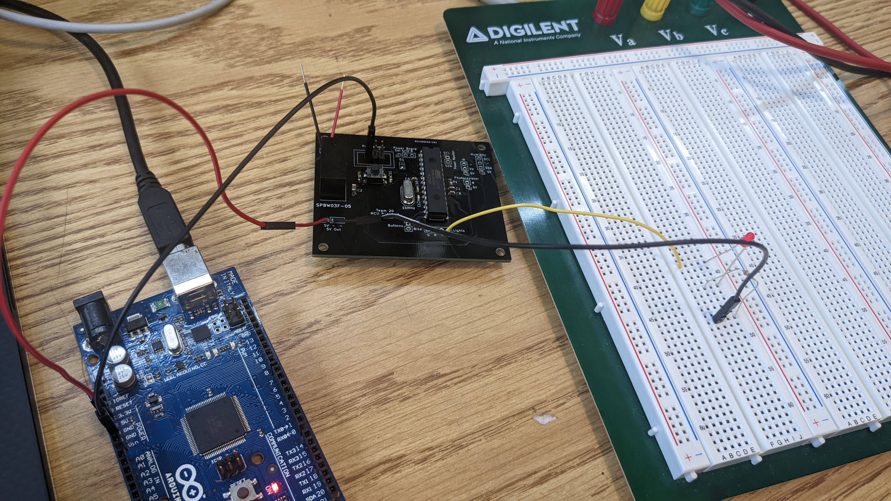

## 3/26/22
Today I helped Richard set up his development configuration on his Arduino MEGA so he could program our microcontroller. I also redesigned the light board.

I moved the traffic light MOSFETs to the proper side, removed the bike light MOSFET, fixed resistor values, and added optional signal/GND jumpers if somehow the optoisolators do not work and we need to control the MOSFETs directly using an Arduino. We also decided to create a "noisy" 5V rail to power our MOSFETs. 
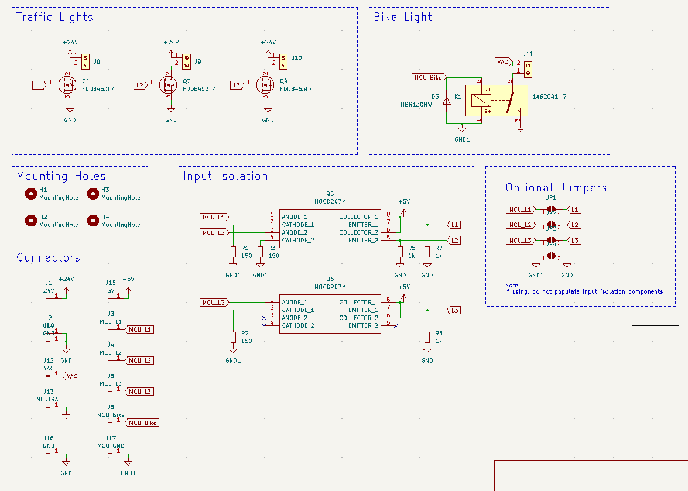
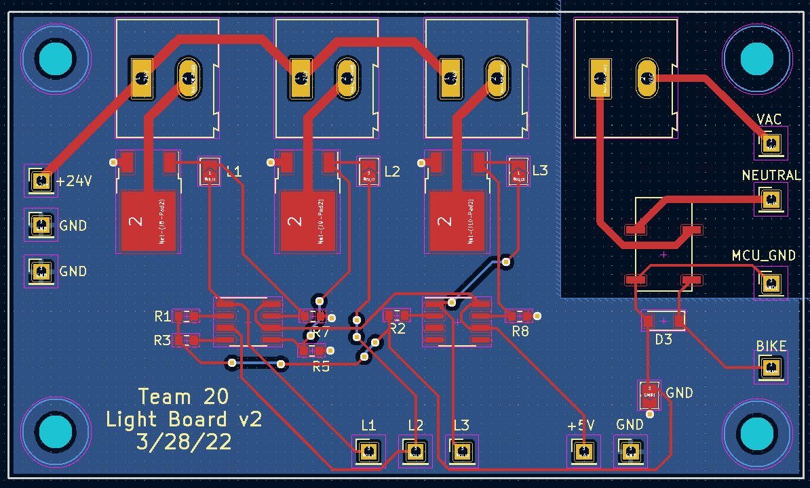

## 3/28/22
Today I put together the SEPIC and tried testing it. I needed to manually solder wires in order for the coupled inductor to be connected correctly. I put the wrong footprint for one of the MOSFETs. It was an SOIC-8 but I put a LFPAK33 on the PCB. Since I was only testing the SEPIC on this power board, I used one of the SOIC-8 spaces meant for an optoisolator and cut one trace so that I didn't short gate to source. What I discovered was that the SEPIC output was non-zero only when the input voltage was aroudn 16V. I spent a while testing connectivity and double checking values and could not get it to work. Colin suggested that maybe I didn't solder the LT3757 properly, as its ground was underneath the IC. Once I soldered the ground, everything worked as expected. 

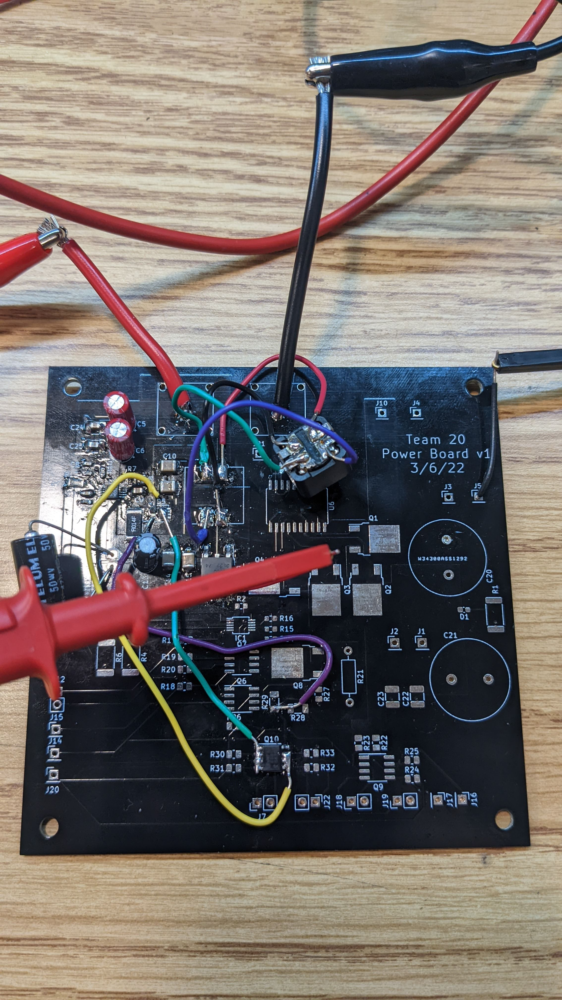
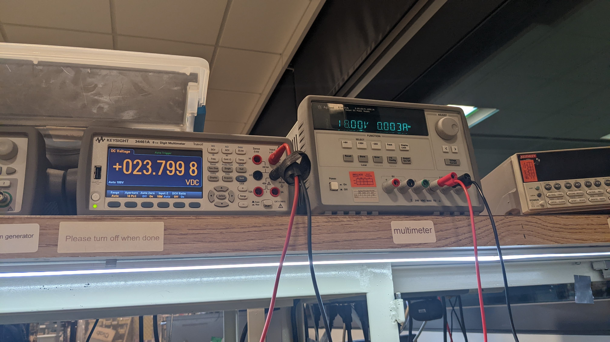

I also made some changes to the power board. Mainly changing some resistor values, fixing the coupled inductor footprint, and adding proper holes for our high current inputs and power resistor/heatsink. Like the light board, I added optional jumpers to bypass the input isolation. I added thermal reliefs to large zones to make soldering easier. 
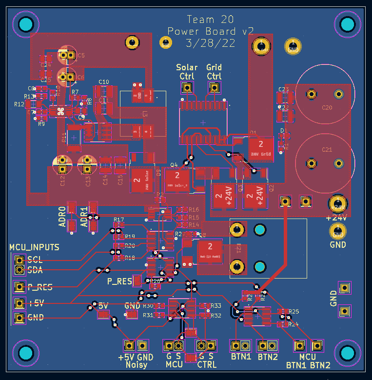