# Colin Worklog

# 2022-02-07 - Meeting for Project Proposal
We met to discuss the inner workings of the project proposal.  Specific attention was paid to the parts (i.e. sensors) and the block diagram, which Richard and I developed.  Progress is still needed for both of these components before finalizing the proposal by Thursday, 02/10.

# 2022-02-08 - First Meeting with Qingyu
Today we met with Qingyu for the first time to discuss where our project is at right now.  We will shift our focus to a few key details as we finish the project proposal:
1. Planning how we will demonstrate the various functions of the traffic light
2. Adding details to block diagram (i.e. sensor protocols and specific parts)
3. Contacting TA Evan Widloski and Professors Schuh and Banerjee about the power switching component of our design
    * LTC4412 - OR'ing of multiple power sources ([datasheet](datasheets/LTC4412.pdf "LTC4412"))
    * Power MUX
    * Possibility of manual switch (worst case scenario)

I will email the people listed above for advice about which strategy to use, while in the search of new ideas.

# 2022-02-10 - Finishing the Proposal
Today we were able to put the finishing touches on the project proposal by clarifying the high-level and subsystem requirements.  I also placed a sample order for the LTC4357 and LTC4359 chips from Analog Devices.  The chips will be delivered soon and a pair of one device (likely LTC4359) will be used to manage the switching between the solar and grid power.  They will control which source is used by driving an external pair of complementary MOSFETs.  These MOSFETs still need to be chosen.  Refer to the following datasheets: [LTC4357](datasheets/LTC4357.pdf "LTC4357") and [LTC4359](datasheets/LTC4359.pdf "LTC4359")

# 2022-02-14 - Selecting More Components
We met today to discuss some of the finer details of the project that had not been ironed out yet.  We have now decided on the LTC4359 to aid in the switching of the two power sources, but are also exploring options about how to monitor the available solar power when it has already been switched off.  Our most likely option is a "dummy" load consisting of a simple power resistor but we will discuss this with out TA tomorrow.

Additionally, we will utilize the [LTC4151-1](datasheets/LTC4151-1.pdf "LTC4151-1") power monitor in order to detect the power available from the solar panel.

# 2022-02-15 - Weekly TA Meeting
After discussing with Qingyu during our weekly meeting, we have decided to follow through with the dead load resistor to allow the power monitor to determine the power generated by the solar panel.  When it is above a threshold of approximately 20 W, set by choosing a resistor such that PR = V2 for P = 20 W and V = 24 V.  This resistance value may be decreased further based on power consumption approximations.  A rough sketch can be seen in the following schematic, which will be expanded upon in later meetings and the PCB design.

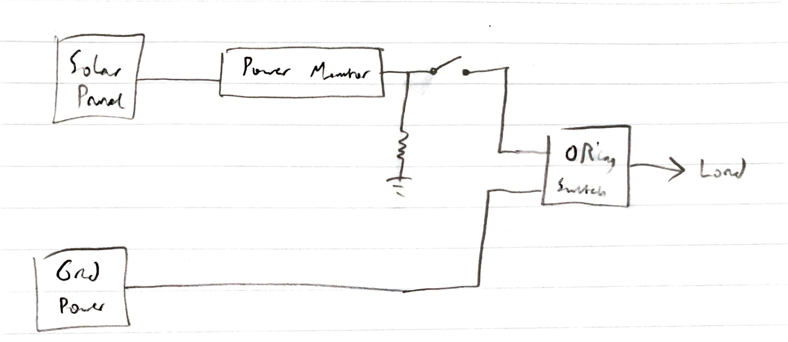

# 2022-02-22 - Designing SEPIC Converter
We had intended on utilizing some sort of buck-boost converter to regulate the solar output voltage to 24 V ± 5% but had not yet chosen a DC-DC comversion topology.  In order to minimize the ripple at the output and provide a stable voltage to the rest of the system, we chose a single-ended primary-inductor converter (SEPIC).  A rough sketch of this can be seen below:

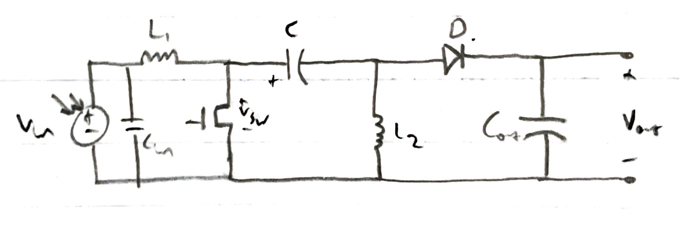

Calculations to ensure the SEPIC can withstand minimum and maximum duty cycles and to determine component selection and ratings can also be seen below:

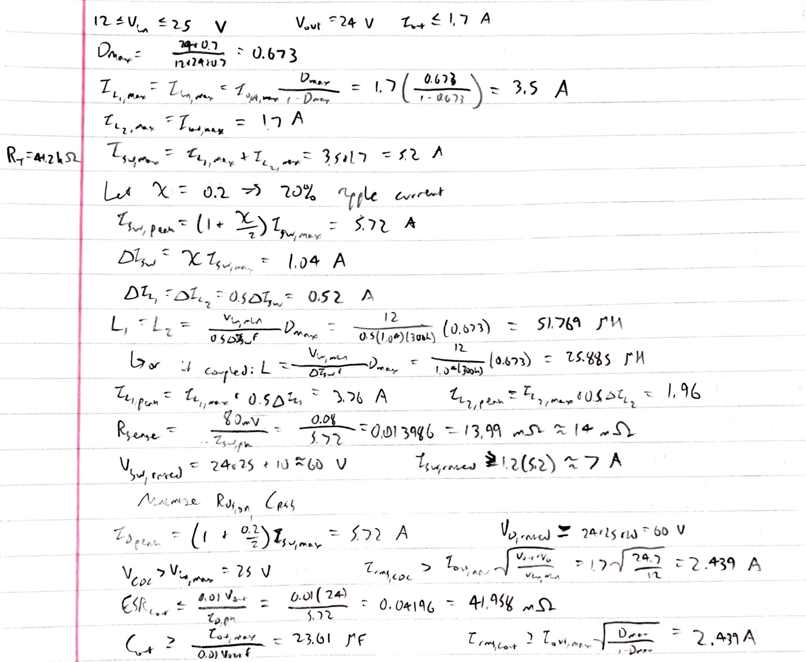

# 2022-02-23 - Back to the Drawing Board for the Switching Network
Today I worked on the switching network of our power subsystem, which will be responsible for automatically switching between the two power sources.  Our initial idea and design involved an ORing controller ([LTC4359](datasheets/LTC4359.pdf "LTC4359")).  This circuit can be seen below:

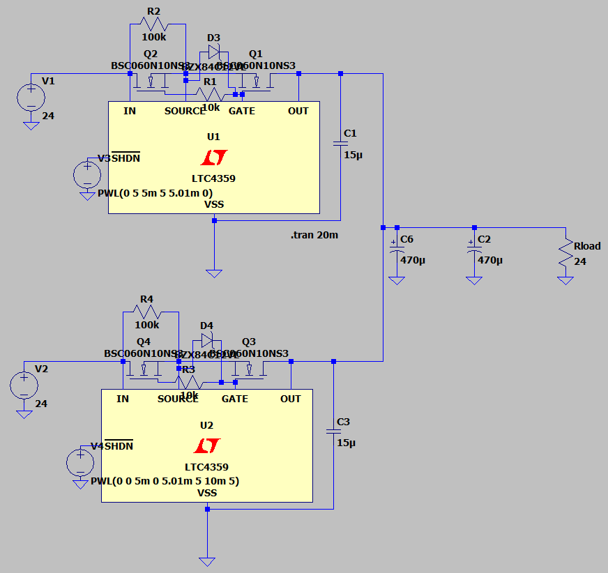

However, we decided to move away from this design due to the substantial voltage drop while switching between the sources.  The simulation waveform (with compensation capacitors at the output) can be seen below with a significant voltage dip:

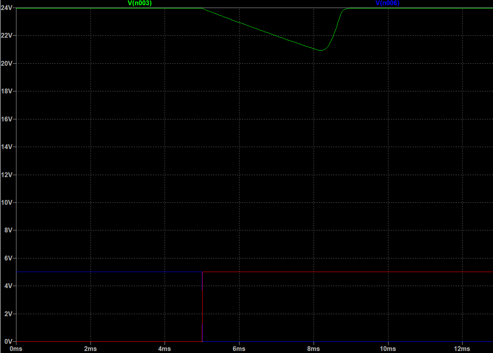

# 2022-02-23 - New Switching Network Design
I realized that in order to switch between the sources while protecting against reverse current between them, it would be possible to simply use two MOSFETs in opposite orientations for each source.  This can be done by controlling a quad high-side gate driver ([LT1161](datasheets/LT1161.pdf "LT1161")) via the microcontroller.  In LTspice, one can emulate this behavior by sending complementary signals into the inputs of the gate driver.  The schematic and waveform can be seen below:

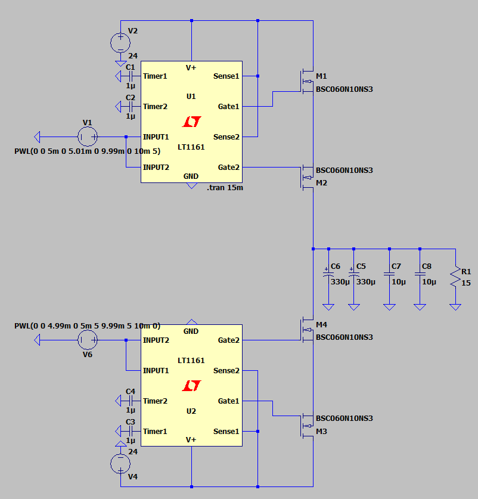

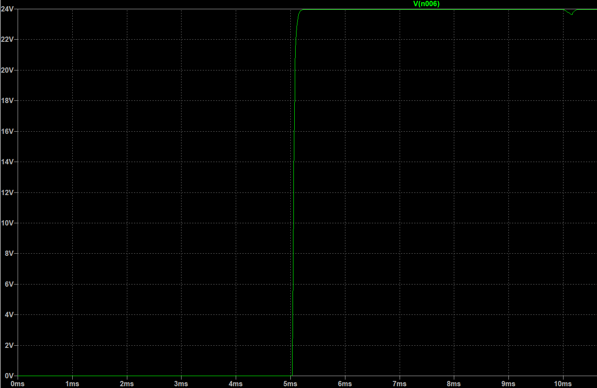

As we can see, the voltage dip is negligible compared to that of the original design using the LTC4359 chip.  I can confidently say this is a simple method to switch between the sources while providing the desired functionality and protection.  One must note that the gate driver must possess high-side functionality due to the MOSFETs being along the 24 V node.

# 2022-02-24 - Finishing Design Document
Today we finished up the design document, taking into account feedback from our Design Document Check with Professor Shao.  We have added additional details into our high-level requirements based on this feedback.  Additionally, we realized that we must select a proper heat sink for the power resistor at the solar output.  Without it, our chosen resistor is only rated for 3 W.

# 2022-03-01 - Discussing Voltage Isolation
Today we discussed whether to implement isolation between the 24 V voltage levels and the 3.3 V and 5 V levels required for the MCU and sensors.  This would require additional components beyond what we already ordered for our power board but we decided this was worth the extra effort to ensure signal integrity for our sensors.  Thus, we will be altering our existing power board to include small (2-5 W) isolated DC-DC converters.  Based on our calculations of the power consumption of our MCU and sensors, we will draw a maximum of 0.5 W from our converters.

# 2022-03-02 - Voltage Isolation Designing
Upon further analysis, we have decided to move the step-down voltage conversion to the MCU board to be closer to the sensors and MCU.  Thus, we will also require jumpers between the boards to provide 5 V and isolated ground to the power board for a few components.  We have decided to utilize the [SPBW03F-05](datasheets/SPBW03F-05.pdf "SPBW03F-05") isolated DC-DC converter for our 5 V level.  This provides isolation and is rated for up to 3 W, which provides the maximum required power drawn by the sensors and allows leeway for additional power drawn during the operation of the MCU.

Additionally, in order to allow for proper voltage isolation, we will include [MOCD207M](datasheets/MOCD207M.pdf "MOCD207M") opto-isolators that can transmit the signals from our sensors across the different ground levels.

It is important to note that the 3.3 V DC-DC converter will no longer be utilized.  The humidity sensor was the only component that would require 3.3 V, which is unnecessary considering it can safely operate at 5 V.

# 2022-03-04 - MCU Board Design in KiCAD
Today I began the design of the MCU board in KiCAD, which will include selecting parts and their corresponding footprints, developing the schematic, and routing traces and any additional debugging on the PCB side of KiCAD.  I plan on designing the board in this order and hope to finish it within the next few days.

# 2022-03-07 - Finished MCU Board
The MCU board is now complete and has passed PCBway audit.  I have now submitted a parts order online and sent the functional Gerber files to Qingyu.  The schematic and board itself are located below:

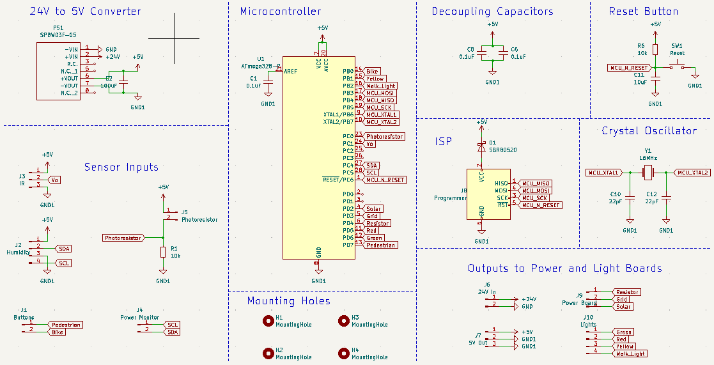

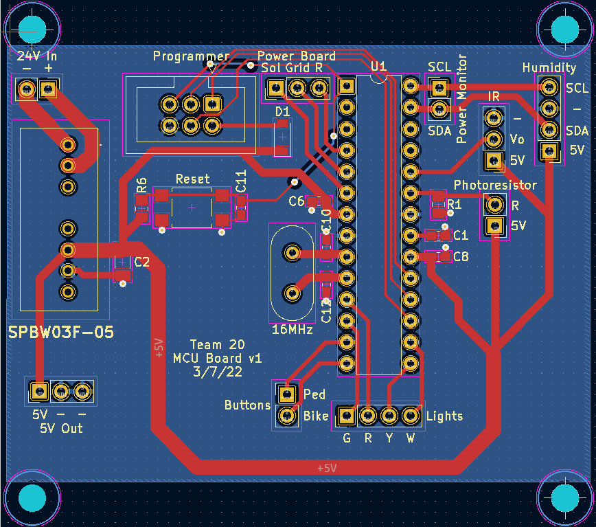

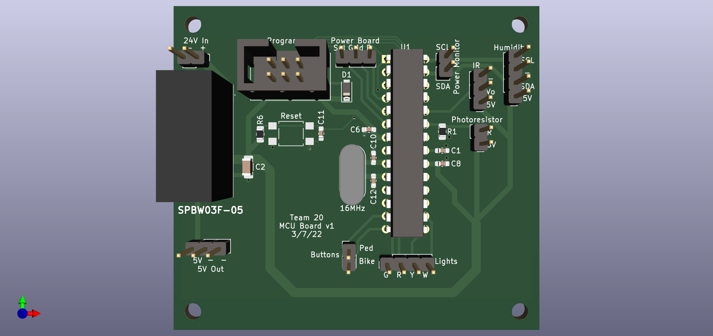

# 2022-03-10 - Testing Bike/Pedestrian Light
Richard placed a sample for the bike and traffic lights from Leotek and he and Bowen tested the DC traffic light modules for their various operating points and turn-on points previously.  However, the bike light we received ([Datasheet](datasheets/BikeLight.pdf "Bike Light")) is AC-powered and needed to be tested in the power lab to determine its operating points. I was able to access the Power Lab today to utilize the Variac and Yokogawa power meters for this purpose.  Combined with the previous operating points determined by Bowen and Richard, the following values represent the operating point of each of our lights:

Red: 24 V, 0.23 A, 5.52 W

Yellow: 24 V, 0.21 A, 5.04 W

Green: 24 V, 0.31 A, 7.44 W

Bike: 120 VAC, 0.054 A, 6.48 W

# 2022-03-22 - Meeting with Gregg at the Machine Shop
Today we went into the Machine Shop to discuss our project with Gregg.  Now that we have our parts and PCBs, we are able to plan out more specifics of our physical design.  He suggested that we enclose out devices, including traffic light modules, sensors, and PCBs, in a large (~4 ft tall) box.  The sensors will be placed in a separate smaller box on top to allow the humidity and IR sensors to properly interact with the environment.

# 2022-03-23 - Power Board Testing Starts
I began soldering the power board to document any potential changes we would need to make to our future iteration(s).  Immediately upon preparing the board and parts to start soldering, I noticed that the footprint for the SEPIC converter's MOSFET (Q5) was incorrect.  The footprint chosen was the LFPAK33, whereas the FDS5670 MOSFET's footprint is SO-8.  This will need to be altered for our next iteration.

Another important step taken today was sorting the parts between each of the three PCBs.  Excess parts that were ordered prior to our most recent PCB update have been taken home to avoid confusion.

# 2022-03-28 - Testing Switching Network
Bowen and I had previously tried to test the switching network, but were confused about its functionality.  With the control signals set up so that the grid voltage is connected to the output, the output is 24 V as expected.  However, when connected so that the solar voltage is selected, the output seems to vary randomly.  I connected the circuit as follows to test and debug its functionality:

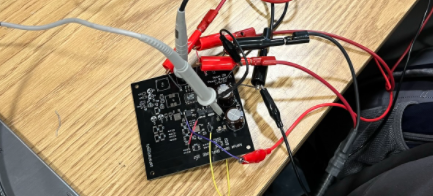

This setup includes the DC power supply to provide 24 V input to simulate both solar and grid sources, a two-channel waveform generator to control the gate driver inputs for solar and grid power, a multimeter to probe various voltages and perform continuity checks, and an oscilloscope to view how the output voltages changes relative to the switching.

I eventually realized that the datasheet for the [LT1161](datasheets/LT1161.pdf "LT1161") quad high-side gate driver states that the four timer pins should be left open if the sensing functionality is not being utilized.  However, our design contained 1 uF capacitors to GND at each of these pins.  Upon removing these capacitors, the switching network behaved
as intended.  This change is reflected in our most recent iteration of the power board.

# 2022-03-29 - Designing 5 V Buck Board
Bowen suggested the idea of utilizing the excess components from our previous 5 V buck converter design in the place of his resistor divider that could not provide sufficient current for the light board MOSFETs.  I designed an additional PCB, our fourth total, that converts 24 V to 5 V via the [LM2575-5](datasheets/LM2575-5.pdf "LM2575-5") regulated converter IC.  The schematic and board can be seen below:

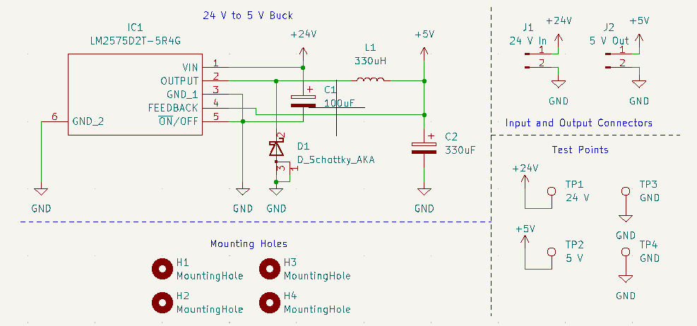

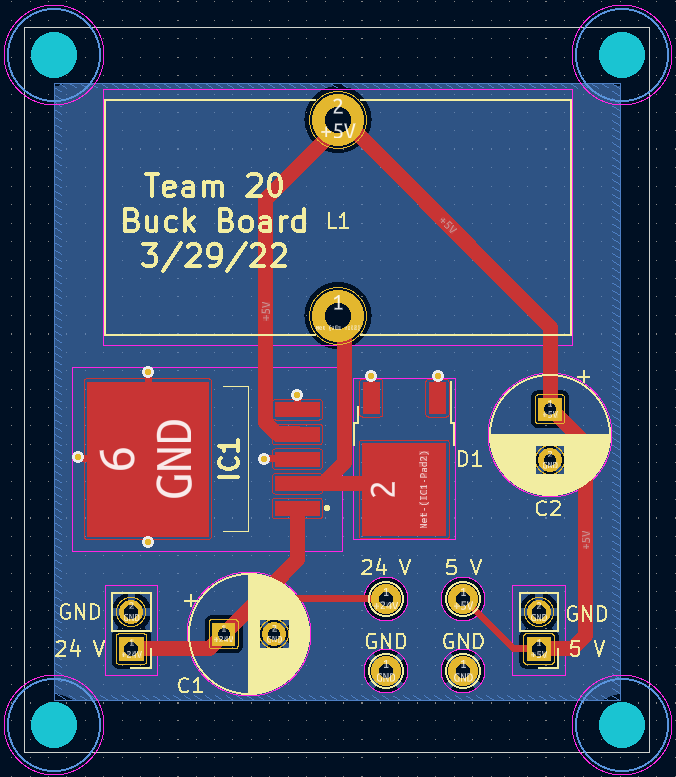

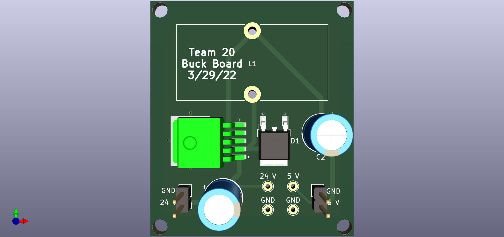

This board, in addition to our revised power and light boards, are expected to arrive around April 11.

# 2022-04-09 - Testing Power Monitor and Optoisolators
Richard was testing the power monitor and optoisolators, and seemed to have trouble while unit testing the optoisolators.  They did not seem to respond to voltage changes at the input, so I decided to do some testing on my own.  I was able to probe the voltage at the pins of the power monitor, all of which seemed to be within reasonable bounds.  The optoisolators also responded, so I suggested to Richard that the issue may have been unit testing the power monitor and isolation without the rest of the design.  We will be moving on to fully testing the design.

# 2022-04-13 - New PCBs
The new PCBs just came in, so today I spent time soldering and testing the buck board and power board.  The buck board is fully operational over the range of 24 V +/- 5%, as indicated by out R&V tables.  I was only able to solder the switching network on the power board, but will have to wait to fully test it or the other components of the power board.

# 2022-04-14 - Testing Switching Network
Today I decided to finish testing the switching network, which I had fully soldered yesterday.  Upon testing it, I realized that its behavior was very unexpected.  The design would struggle to switch between the sources, primarily when switching from grid to solar power.  I dove into the datasheet for the [LT1161](datasheets/LT1161.pdf "LT1161") chip and discovered a glaring issue.  The sense pins should all be connected to the supply voltage when the sensing capability is not being used, which we chose to do.  However, I designed the system such that two of the sense pins are connected to the grid voltage, while the other two are connected to the solar voltage.  This leads to incorrect operation of the switching network, as the solar sense pins should be corrected to the supply voltage as well.  To solve this, I simply cut a trace on the back of the PCB and soldered a jumper wire to connect the remaining two sense pins to the supply voltage.

Upon making this change, the switching network behaves as expected.  I tested it by using two complementary square waves at 120 Hz to simulate the solar and grid control, with two outputs from the power supply providing 24 V.  The output voltage did not dip at all while switching, which can be seen in the following figure:

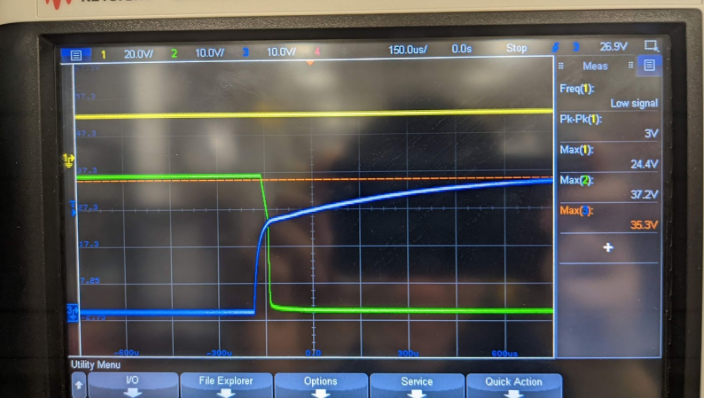

The yellow, green, and blue waveforms represent the 24 V output, grid control, and solar control.  Due to the short switching time and the bulk capacitance at the output of the switching network, there is no drop in voltage.

# 2022-04-19 - Mock Demo
Today we had our mock demo with Qingyu, and were able to demonstrate all portions of our overall design besides the power monitor.  From here, we just need to fully assemble everything and debug the power monitor.

# 2022-04-22 - Debugging Power Monitor
We have been debugging the power monitor for the last few days, to no avail.  It looks like we will choose a backup plan of a photoresistor that will provide a threshold of light, at which point the MCU will switch to solar power.  The power monitor does not appear on the I2C bus, which is most likely due to the unique "inverted SDAO" pin that is available, rather than a single SDA line.  We have tried inverting this pin and connecting the SDAI and SDAO pins together, which still provided no solution.  Thus, the backup plan is much more feasible at this point.

# 2022-04-25 - Final Demo
After spending the last few days assembling and finalizing our project, we had our final demo today.  All necessary requirements were met.
